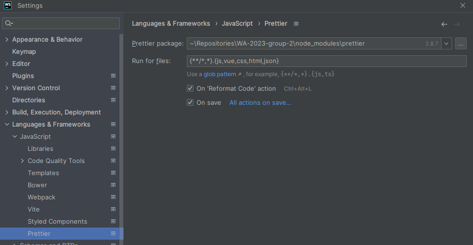
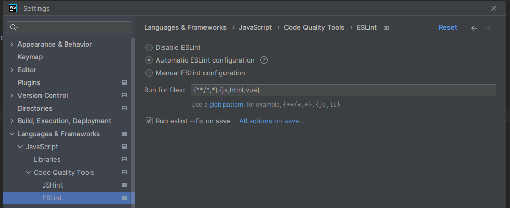

# WA-2023-group-2

This project consists of 2 projects, a front-end client web application in Vue and a back-end server application in
Express with Sequalize, and it is maintained by the following members:

| Name                | Student nr. |
| ------------------- | ----------- |
| Oscar Wellner       | 21144192    |
| Ahmed Benhajar      | 21024154    |
| Marjo Salo          | 21146942    |
| Jeniffer Goudswaard | 21155496    |

This project is maintained from the source repository (https://github.com/nonamer777/wa-2022-group-2)
and for documentation purposes cloned towards to repository owned by our school
(https://github.com/The-Hague-University/WA-2022-group-2).

For the actual workflows (CI/CD, build/test/linting), we recommend inspecting the original repository.
These are stripped while cloning the source repository over to the HHS owned repository in order to
prevent the workflows from activating twice, while the HHS owned repository does not contain the
repository secrets to make some workflows run correctly.

## Deployments

We have two deployments currently available:

- Self-hosted: https://wasted.nl.eu.org/  
  This is a solution which works with Docker, NGINX Reverse Proxy Manager, Let's Encrypt, Node, and our
  back- and front end applications, which all runs on a Raspberry Pi 4. Oscar (who owns the RPi4 machine)
  needs to manually update the used docker images. This could be done automatically but he prefers to
  do it manually so that he is in control of that deployment process and should anything go wrong it
  would be easier to fix this way.
- Azure: https://lemon-bay-04c12da03.3.azurestaticapps.net/  
  This is a solution which uses Azure deployment workflows to deploy a build of the front-end to Azure
  and uses the Docker image of the back-end, which also gets deployed to Azure. This solution is fully
  automatic.  
  Unfortunately, something is wrong with the database configuration on this deployment, thus making
  this live environment unusable atm.

## Developing

Before you start developing, you should install the project dependencies by running the following command in a terminal
which is opened in the project root:

```shell
npm install
```

### Configuration

The client and server applications use environment variables to
configure its values and processes depending on the environment that the application is running in.
By default, the client and server applications look for an `.env` file inside the `./environment`
folder. You'll also find a template there which you can copy and rename to `.env`.

After that you can find the instructions for the different projects on how to get the projects started

| Project | location                          |
| ------- | --------------------------------- |
| Client  | [Here](packages/client/README.md) |
| Server  | [Here](packages/server/README.md) |

### ESLint and Prettier

This project is working with [ESLint](https://eslint.org/) and [Prettier](https://prettier.io/).
To make your editor work with these tools, please check [here](https://prettier.io/docs/en/editors.html) to make sure
Prettier formats your files after every save. For ESLint, check
[here](https://eslint.org/docs/latest/use/integrations#editors) for more info about configuring your editor

#### Webstorm

For Webstorm, the Prettier configuration should look like the following:



And the ESLint configuration should like the following:



#### Visual Studio Code

For VSC a list with recommended extensions is provided with this project, so please make sure to install those.
The project also contains workspace settings so that those extensions will run on every save to fix formatting and linting
errors, should the pop-up.

Also make sure to check that your workspace settings are correct for auto formatting vue files with ESlint and Prettier
https://pipo.blog/articles/20220103-eslint-prettier-vue3#vs-code-formatonsave

### Docker

For the individual projects, a docker image is available to run the applications via Docker so no other tools should be
required to be downloaded in order to run the applications.

Find the scripts in the `package.json` to create a Docker image locally of the server. For the configuration of your
local Docker stack, create a folder where you'll keep your configuration files for the applications and add another
file to it with the name `compose.yaml`, with the following contents:

```yaml
# ./compose.yaml
client:
  image: wasted-vue-client
  container_name: wasted-client
  ports:
    - '5173:80/tcp'
  depends_on:
    - server
server:
  image: wasted-server
  container_name: wasted-server
  env_file:
    - ./.env
  ports:
    - '8080:8080/tcp'
  volumes:
    - ./config.json:/app/config.json
    - ./database.json:/app/database.json
  depends_on:
    db:
      condition: service_healthy
# optional database service
db:
  image: mysql
  container_name: wasted-mysql-db
  ports:
    - '3306:3306/tcp'
  healthcheck:
    test: ['CMD', 'mysqladmin', 'ping', '-h', 'localhost']
    start_period: 20s
    interval: 5s
    timeout: 20s
    retries: 3
```

This configuration assumes a couple of things:

- The `config.json`, `.env`, and the `database.json` files are in the same folder as the `compose.yaml` and the `config.json`
  should have a `server.databaseConfigPath` attribute set to `./database.json`. This later must be done because of the way
  how the node process runs inside the Docker container.
  These configuration files will have the following contents, based on this compose configuration:

```json5
// ./database.json
{
  production: {
    dialect: 'mysql',
    host: 'db',
    port: 3306,
    username: 'username',
    password: 'password'
  }
}
```

```
# ./.env

# Shared variables
VITE_JWT_SECRET=my super secret jwt secret
NODE_ENV=production


# Server variables
ENV_PATH=./.env
DATABASE_CONFIG_PATH=./database.json
ALLOWED_ORIGINS=http://localhost:5173


# Client variables
VITE_SERVER_BASE_URL=http://localhost:8080
```

- You have port `8080` available on you local machine.
